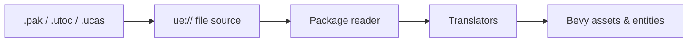

# ue-rust

**Open a shipped Unreal Engine 5 game's files in [Bevy](https://bevyengine.org). Pure Rust.**

[](LICENSE)
[](https://bevyengine.org)
[](https://www.rust-lang.org)
[](#where-it-is-now)

Want to port an Unreal game to Rust? The hard first step is getting at its content: meshes, textures, materials and levels are locked inside packed `.pak` and `.utoc`/`.ucas` files in a format only Unreal understands.

ue-rust opens those files and hands what's inside to Bevy as normal Bevy assets. Point it at a game folder, pick a map, and walk around it.

> **Heads up:** ue-rust is in its early design stage. Nothing below works yet. It shows how ue-rust will work. See [Where it is now](#where-it-is-now).

## What it will look like

```rust
use bevy::prelude::*;
use bevy_unreal::prelude::*;

fn main() {
    App::new()
        .add_plugins((DefaultPlugins, UnrealPlugin::from_profile("games/my_game.toml")))
        .add_systems(Startup, load_map)
        .run();
}

fn load_map(mut commands: Commands, assets: Res<AssetServer>) {
    commands.spawn(UnrealWorldRoot(assets.load("ue://Game/Maps/Arena.umap")));
}
```

That's it. The level's meshes, materials, lights and collision show up as ordinary Bevy entities.

Prefer not to write code? Use the viewer:

```sh
cargo run -p unreal_viewer -- --profile games/my_game.toml
```

Pick a map from the list, fly around with WASD and the mouse, and press Tab to walk instead.

## Setting up a game

Each game gets a small profile file that tells ue-rust where the files are and how to open them:

```toml
# games/my_game.toml
game_dir = "C:/Games/MyGame"
engine_version = "5.4"
aes_keys = ["0x0123...ABCD"]        # only if the game encrypts its files
usmap = "games/my_game.usmap"       # only if the game strips property names
oodle = "rust"                      # "rust" (default) or "epic"
```

You may need two extra things, depending on the game:

| You need | When | Where to get it |
|---|---|---|
| **AES key** | The game encrypts its files | From the game itself; community key lists exist for many games |
| **`.usmap` name map** | The game strips property names (most UE5 games do) | Run [UE4SS](https://github.com/UE4SS-RE/RE-UE4SS) or [jmap](https://github.com/trumank/jmap) while the game is open |

ue-rust checks the profile at start-up and tells you exactly what's missing.

## How it works



1. **File source.** Opens every container in the game folder, so to Bevy the whole game looks like one folder.
2. **Package reader.** Reads any Unreal object into a generic tree of named values. This works for every asset type from day one, even ones ue-rust can't convert yet.
3. **Translators.** One per Unreal asset type, each turning that tree into a real Bevy thing: a `Texture2D` becomes an `Image`, a `StaticMesh` becomes a `Mesh`, a `Material` becomes a `StandardMaterial`, and a map becomes entities.

Adding support for a new asset type means adding one translator. The full design is in [docs/superpowers/specs](docs/superpowers/specs/2026-10-07-level-walk-design.md).

## Where it is now

| Milestone | What you get | |
|---|---|---|
| [**M1 Level walk**](https://github.com/wildware-uk/ue-rust/milestone/1) | Open a UE5 map: meshes, textures, materials, lights, terrain, collision. Fly and walk. | Planned, next up |
| [**M2 Characters**](https://github.com/wildware-uk/ue-rust/milestone/2) | Skeletal meshes and animation | Later |
| [**M3 Detail**](https://github.com/wildware-uk/ue-rust/milestone/3) | Nanite, streaming big maps, painted terrain, better materials, UE4 games | Later |
| [**M4 Data and sound**](https://github.com/wildware-uk/ue-rust/milestone/4) | Data tables, text and audio | Later |
| [**M5 UI and AI**](https://github.com/wildware-uk/ue-rust/milestone/5) | Menus and HUDs, behaviour trees, navmesh | Later |
| [**M6 Logic**](https://github.com/wildware-uk/ue-rust/milestone/6) | Blueprint decompiler, Unreal-style gameplay building blocks | Later |

Follow along in the [issues](https://github.com/wildware-uk/ue-rust/issues).

## Questions

**Will it work with any Unreal game?**
UE5 games on Windows PC come first; UE4 support follows in M3. Some games change Unreal's file format in their own way, and those may need extra work.

**Do I need Unreal Engine installed?**
No. You only need the game's files.

**Does it port the game's code?**
It can't port the C++. A shipped game's C++ is compiled into the `.exe` and can't be turned back into readable code. ue-rust brings over the content, and later the Blueprint logic, which is stored in a readable form. It also gives you Unreal-style building blocks, so rewriting the rest in Rust feels familiar.

**Will materials look exactly like the original?**
Close, not exact, for now. Shipped games keep only compiled shaders, not the editor's material graphs. ue-rust matches material parameters (base colour, normal, roughness and so on) to Bevy's standard material, so surfaces are recognisable.

**Is it really pure Rust?**
Yes. One opt-in exception: if you want, ue-rust can load Epic's own Oodle decompression library at runtime instead of the built-in Rust decoder.

## Please use it responsibly

ue-rust is a tool for porting, modding, preservation and learning. It never includes any game's content, and this repository never will. Only use it on games you own, and respect their licences. Don't share content you don't have the rights to.

## Thanks

ue-rust stands on the shoulders of people who worked out Unreal's formats first:

- [CUE4Parse](https://github.com/FabianFG/CUE4Parse): the reference for most file formats. Code ported from it is credited in [NOTICE](NOTICE).
- [FModel](https://github.com/4sval/FModel), [UEViewer](https://github.com/gildor2/UEViewer) and [stove](https://github.com/bananaturtlesandwich/stove): studied to see how others solved the same problems.
- [repak](https://github.com/trumank/repak) and [retoc](https://github.com/trumank/retoc): `.pak` and IoStore support.
- [UE4SS](https://github.com/UE4SS-RE/RE-UE4SS) and [jmap](https://github.com/trumank/jmap): `.usmap` name maps.

## Licence

[Apache-2.0](LICENSE).
